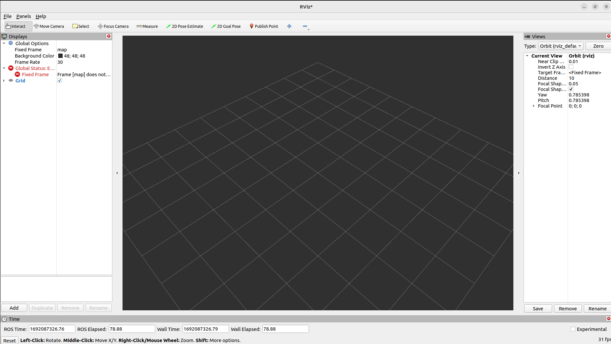
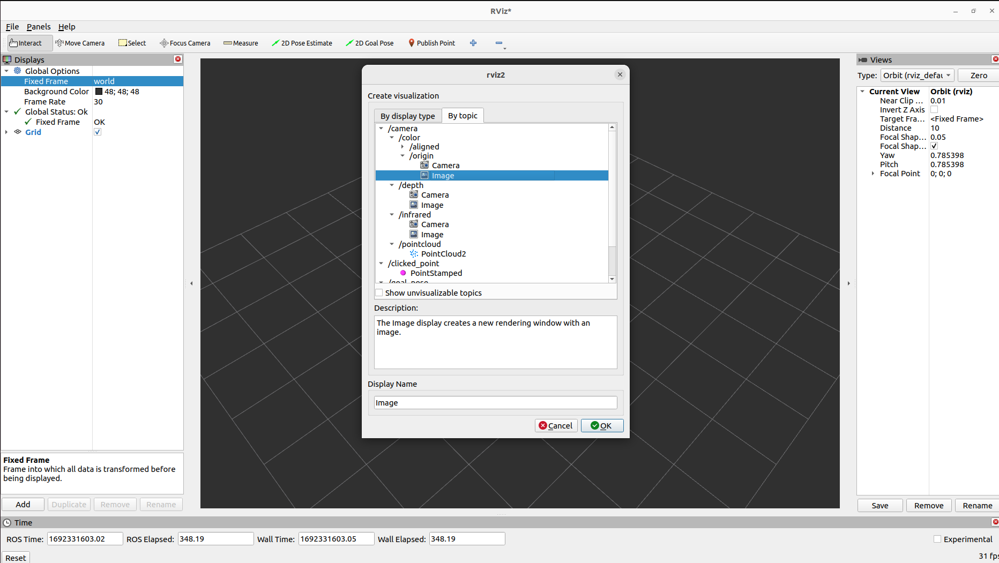
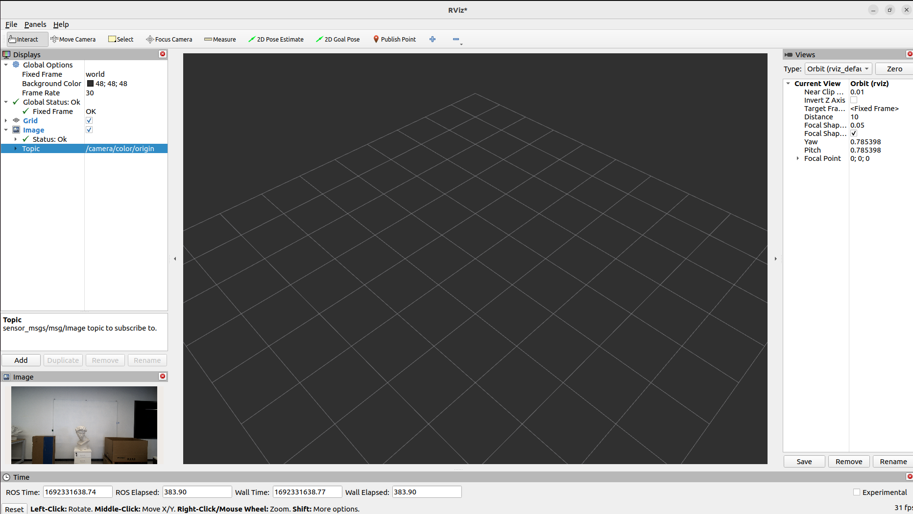
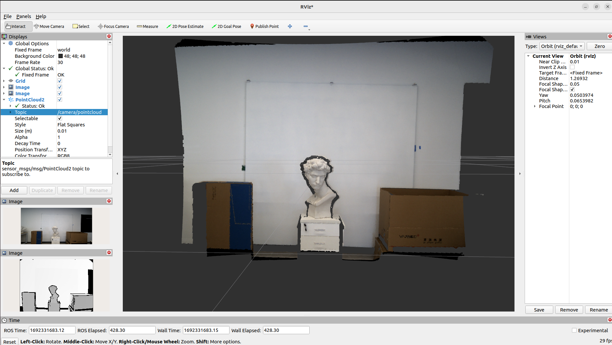

# For Ubuntu 22.04 with ROS2 (USE ros Humble as an example)

## Step 1: ROS2 Installation

* install ROS2 Humble according to [Ubuntu-Install-Debians](https://docs.ros.org/en/humble/Installation/Ubuntu-Install-Debians.html)

## Step 2: Vidu SDK

* Install Vidu SDK according  to  https://github.com/point-spread/ViduSdk/blob/main/README.md
* Thus the `find_package(Vidu_SDK_Api REQUIRED)` is good.

## Step 3: ROS2 workspace

* Create a ROS2 workspace
  ```bash
  mkdir -p ~/ros2_ws/src
  cd ~/ros2_ws/src/
  ```
* Copy the Vidu ROS2 interfaces and wrapper to workspace
  ```bash
  cd ViduSdk/ros
  cp -rf vidu_ros2_interfaces vidu_ros2_wrapper ~/ros2_ws/src/
  cd ~/ros2_ws/
  ```

## Step 4: Install dependencies

* Install the dependencies for ROS2 packages
  ```bash
  sudo apt-get install python3-colcon-common-extensions -y
  sudo apt-get install python3-rosdep -y
  sudo rosdep init # "sudo rosdep init --include-eol-distros" for Dashing
  rosdep update
  rosdep install -i --from-path src --rosdistro $ROS_DISTRO -y
  ```

## Step 5: Build

* Use ROS2 build tool to build both `vidu_ros2_interfaces` and `vidu_ros2_wrapper`.

```bash
colcon build --packages-select vidu_ros2_interfaces
colcon build --packages-select vidu_ros2_wrapper
colcon build
```

Other useful commands are:

```bash
colcon build --packages-select vidu_ros2_wrapper --event-handler console_direct+
```

## Step 6: Sourcing the ROS2  environment

```bash
cd ~/ros2_ws
source install/setup.bash
```

## Step 7: Use Vidu_ROS2_Wrapper to publish images, pointclouds and more.
Open another terminal, connect an Okulo Camera to your computer, and run up the `vidu_ros2_wrapper_node`

```bash
source install/setup.bash
ros2 run vidu_ros2_wrapper vidu_ros2_wrapper_node
```

Then, with ros2 node and ros2 topic tool, you can see the nodes, and topics

```bash
$ ros2 node list
/vidu_ros2_wrapper_node
$ ros2 topic list
/camera/color/aligned
/camera/color/origin
/camera/depth
/camera/extrinsics/color_to_depth
/camera/info/color
/camera/info/depth
/camera/infrared
/camera/pointcloud
/parameter_events
/rosout
/tf
```


## Step 8: Use `rviz2` to visualize the Images and PointClouds
ROS2 provides ready-to-use `rviz2` tool to visualize image and pointclouds topics.
```
rviz2
```



Now you can add a Image topic to visualize the `/camera/color/origin`.





Moreover, you can visualize the pointcloud. **NOTE**, you have to:
1) set the `Global Options->Fixed frame` field to `world`, 
2) click `Add` button, on the bottom-left of `Displays` panel, add PointCloud2 topic,
3) modify `PointCloud2->Topic` to `/camera/pointcloud`,
4) use `ros2 topic echo /camera/pointcloud` to check if the `vidu_ros_wrapper_node` is publishing pointcloud message.



