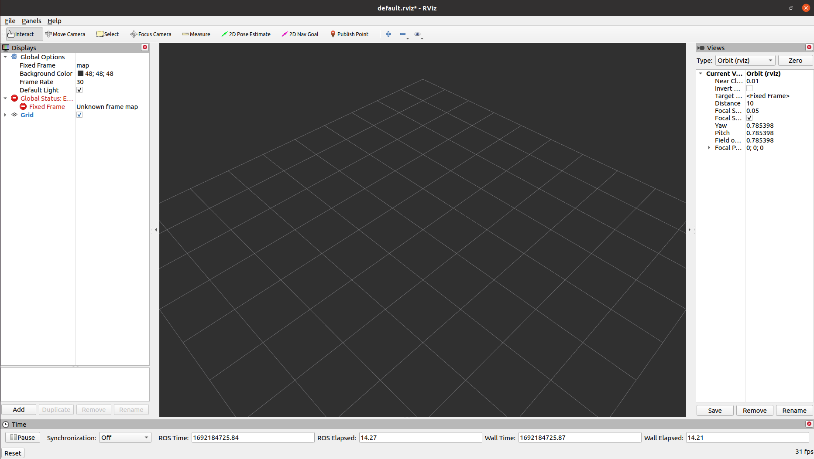
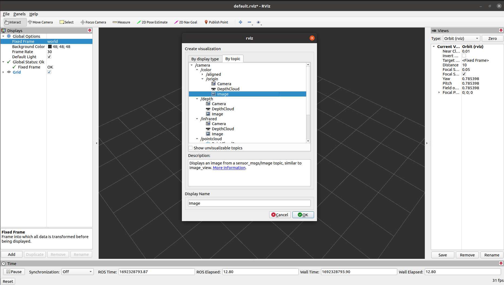
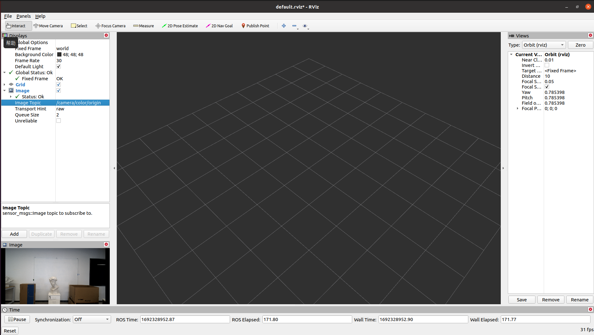
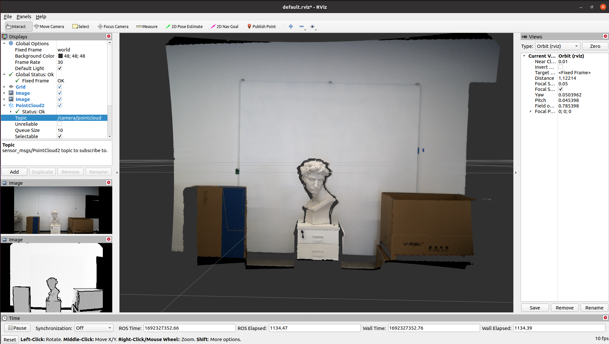

# Vidu Ros Wrapper
This ros wrapper is to grab the `Okulo` camera's image streams including pointclouds to publish as multiple `rostopic`s, which are friendly to the development of robotics.

***NOTE***: If you are a beginner to ROS, we highly recommend you first take some time to learn the basic concepts and tools from [ROS tutorial](http://wiki.ros.org/ROS/Tutorials).
## 1. Prerequisities
1. An Okulo P1 or C1 camera 
2. Ubuntu 20.04

## 2. Installation Guides 

### 1) ROS Installation

* For Ubuntu 20.04 with ROS Noetic, install ROS Noetic according to http://wiki.ros.org/noetic/Installation/Ubuntu.

## 2: Vidu SDK
Vidu Ros wrapper relies on the Vidu SDK package, thus you need to install Vidu SDK according  to  https://github.com/point-spread/ViduSdk/blob/main/README.md, so that the `find_package(Vidu_SDK_Api REQUIRED)` in `vidu_ros_wrapper/CMakeLists.txt` is ready.

## 3: ROS workspace
* Create a ROS workspace
    ```bash
    mkdir -p ~/catkin_ws/src
    cd ~/catkin_ws/src/
    ```
* Copy the Vidu ROS wrapper to workspace
    ```bash
    cd ViduSdk/ros
    cp -rf vidu_ros_* ~/catkin_ws/src/
    cd ~/catkin_ws/
    ```
## 5: Build
* Use ROS build tool to build both `vidu_ROS_interfaces` and `vidu_ROS_wrapper`.
    ```bash
    catkin_make clean   -DPYTHON_EXECUTABLE=/usr/bin/python3
    catkin_make         -DPYTHON_EXECUTABLE=/usr/bin/python3
    catkin_make install -DPYTHON_EXECUTABLE=/usr/bin/python3
    ```
## 6: Sourcing the ROS  environment
* Sourcing the ROS environment within your ~/.bashrc so that vidu_ros_wrapper is available after this installation.
    ```bash
    cd ~/catkin_ws
    echo "source ~/catkin_ws/devel/setup.bash" >> ~/.bashrc
    source ~/.bashrc
    ```

## 7: Use Vidu_ROS_Wrapper to publish images, pointclouds and more.
Start up `roscore` in a terminal:
```
roscore
```
Open another terminal, connect an Okulo Camera to your computer, and run up the `vidu_ros_wrapper_node`:
```
rosrun vidu_ros_wrapper vidu_ros_wrapper_node
```
Then, with `rosnode`, `rostopic` you can see the nodes, and topics about 
```
$ rosnode list
/rosout
/vidu_ros_wrapper_node

$ rostopic list
/camera/color/aligned
/camera/color/origin
/camera/depth
/camera/extrinsics/color_to_depth
/camera/info/color
/camera/info/depth
/camera/infrared
/camera/pointcloud
/parameter_events
/rosout
/tf
```
## 8: Use `rviz` to visualize the Images and PointClouds
ROS provides ready to use rviz tool to visualize image and pointclouds topics.
```
rviz
```



Now you can add a Image topic to visulize the `/camera/color/origin`.





Moreover, you can visualize the pointcloud. You have to:
1) set the `Global Options->Fixed frame` field to `world`,
2) add `PointCloud2` topic, 
3) set `PointCloud2->Topic` field to `/camera/pointcloud`



